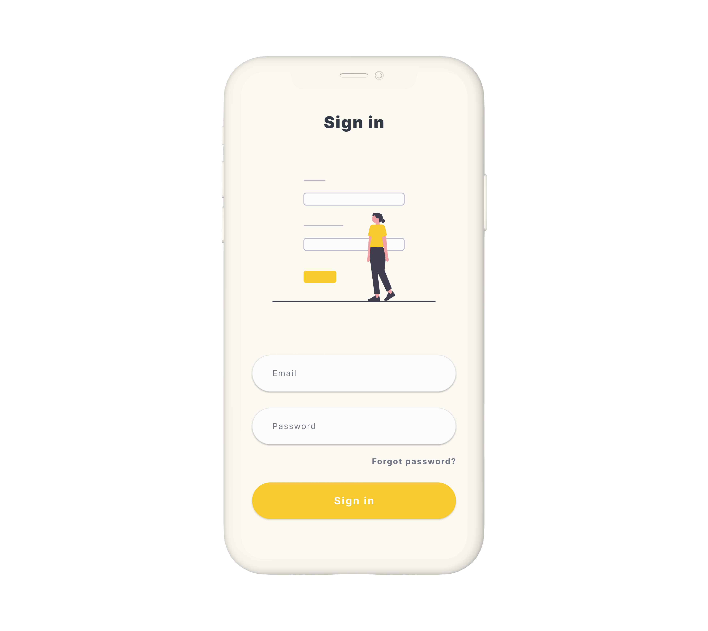
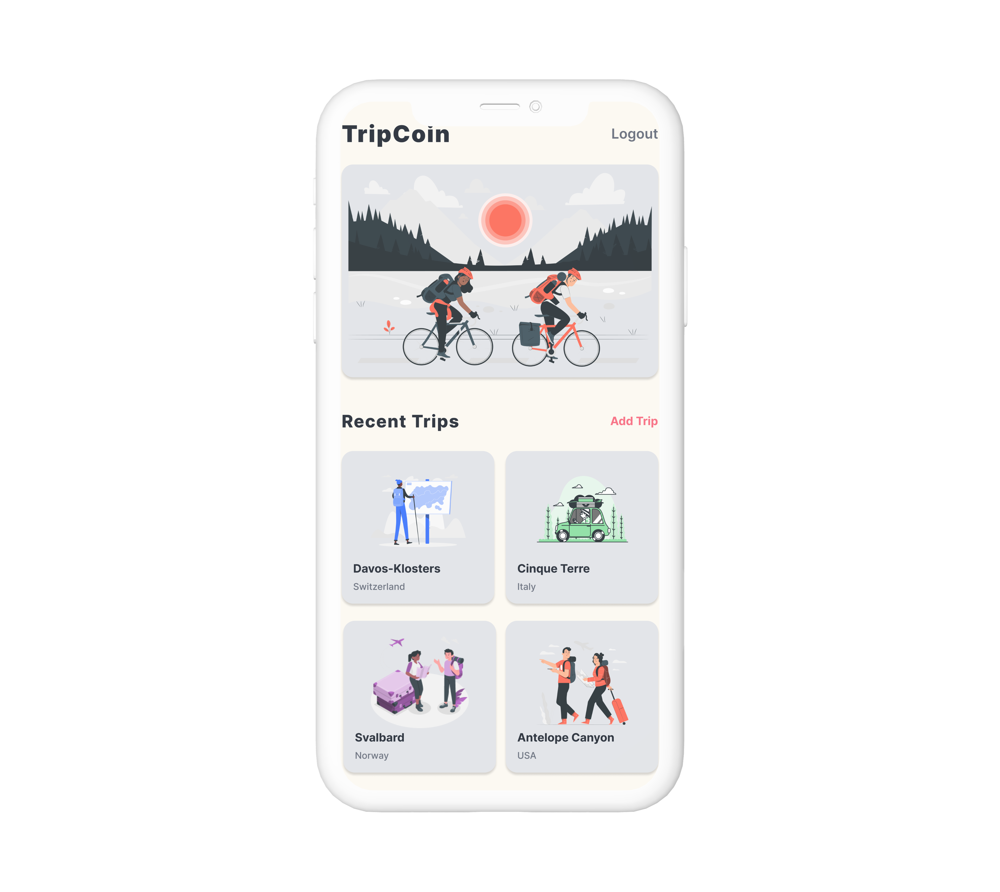

# 💰 TripCoin

TripCoin is a mobile app for managing trips and expenses, allowing users to track expenses, view trip details, and maintain a clear overview of their spending.

---

## ✨ Features

- Create and manage multiple trips  
- Add, edit, and delete expenses for each trip  
- View detailed trip information including total expenses  
- Categorize expenses and manage budgets  
- Form validation for accurate data entry  

---

## 🛠 Tech Stack

- React Native & Expo  
- Context API for state management  
- Formik & Yup (forms and validation)  
- React Navigation  
- Figma for UI/UX design  

---

## 🧠 What This Project Demonstrates

- Trip-focused app architecture with intuitive navigation  
- Expense management logic in a real-world scenario  
- Form handling and validation with Formik & Yup  
- Reusable components and scalable folder structure  
- UX/UI design implementation from concept to app  

---

📲 **Download**
- Android: [APK Download](https://github.com/NedAbed/TripcoinApp/releases/tag/v1.0)
- iOS: Coming soon 🍏

---

## 📸 Screenshots

  

  

